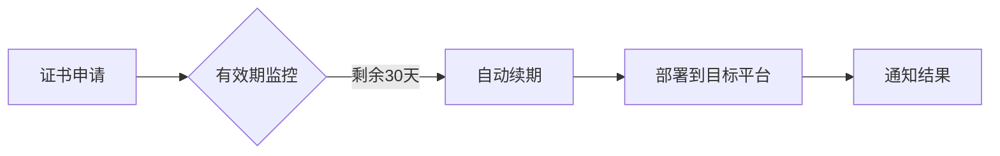
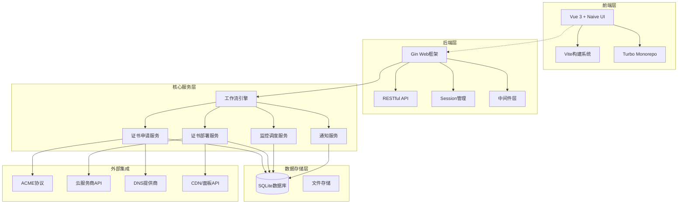

此版本为寒语馨修改的UI版本，出问题概不负责

此版本为寒语馨修改的UI版本，出问题概不负责

此版本为寒语馨修改的UI版本，出问题概不负责

UI并没有放出来是应为，本地环境太乱了，就懒得搞了

如有问题去官方仓库提交https://github.com/allinssl/allinssl


# All in SSL - SSL证书全流程管理工具 🔒

[](https://github.com/allinssl/allinssl?tab=readme-ov-file#AGPL-3.0-1-ov-file)

[](https://github.com/allinssl/allinssl/issues)
[](https://github.com/allinssl/allinssl/releases)
[](https://hub.docker.com/r/allinssl/allinssl)


> 🚀 一站式SSL证书生命周期管理解决方案 | 支持Let's Encrypt、ZeroSSL、Google、SSL.COM、BuyPass等多家CA | 多平台部署 | 自动化运维

<p align="center">
  
</p>

## 📌 项目亮点
- ✅ 全自动证书申请/续期
- 🌐 多平台部署（CDN/WAF/面板/云存储）
- 🔔 证书过期监控
- 🛡️ 安全入口保护
- 📊 可视化证书管理


## 🎯 核心功能

### 📜 证书管理


| 功能         | 支持提供商                          |
|--------------|-----------------------------------|
| DNS验证      | 阿里云、腾讯云、Cloudflare...      |
| 证书部署     | 宝塔面板、1Panel、阿里云CDN、腾讯云COS |
| 监控通知     | 邮件、Webhook、钉钉                |

### ⚙️ 自动化流程


## 🛠️ 技术架构

### 🏗️ 系统架构图



## 📚 使用文档
- [快速入门指南](https://allinssl.com/guide/getting-started.html)
- [操作手册](https://allinssl.com/features/dashboard.html)

## 💻 命令行操作
```bash
# 基本操作
allinssl 1: 启动服务 🚀
allinssl 2: 停止服务 ⛔
allinssl 3: 重启服务 🔄
allinssl 4: 修改安全入口 🔐
allinssl 5: 修改用户名 👤
allinssl 6: 修改密码 🔑
allinssl 7: 修改端口 🔧

# Web服务管理
allinssl 8: 关闭web服务 🌐➖
allinssl 9: 开启web服务 🌐➕
allinssl 10: 重启web服务 🌐🔄

# 后台任务管理
allinssl 11: 关闭后台自动调度 📻⛔
allinssl 12: 开启后台自动调度 📻✅
allinssl 13: 重启后台自动调度 📻🔄

# 系统管理
allinssl 14: 关闭https 🔓
allinssl 15: 获取面板地址 📋
allinssl 16: 更新ALLinSSL到最新版本（文件覆盖安装） 🔄⬆️
allinssl 17: 卸载ALLinSSL 🗑️
```

## 🤝 参与贡献
欢迎通过以下方式参与项目：
1. 提交Issue报告问题 
2. 发起Pull Request改进代码 💻
3. 完善项目文档 📖
4. 分享使用案例 ✨

[贡献指南](https://allinssl.com/community/contributing.html)

## 📞 联系我们
- QQ交流群：[768610151](https://qm.qq.com/q/KTmWuskjm0) 👥
- 邮箱：support@allinssl.com 📧
- 问题反馈：[GitHub Issues](https://github.com/allinssl/allinssl/issues)

## 🙏 致谢

**感谢在SSL证书管理领域做出贡献的开源项目和社区：**
- [Let's Encrypt](https://letsencrypt.org/) - 免费SSL证书颁发机构
- [lego](https://github.com/go-acme/lego) - Go语言ACME客户端，为本项目提供核心证书申请功能
- [acme.sh](https://github.com/acmesh-official/acme.sh) - 纯Shell脚本实现的ACME客户端
- [certimate](https://github.com/usual2970/certimate) - 工作流部分设计参考，以及使用了其京东云DNS的代码实现
- [certd](https://github.com/certd/certd) - 工作流部分的设计参考
- [Certbot](https://certbot.eff.org/) - EFF官方ACME客户端
- [Caddy](https://caddyserver.com/) - 自动HTTPS Web服务器

**感谢以下技术栈和依赖库：**

**🔧 后端依赖**
- **Web框架**: [gin-gonic/gin](https://github.com/gin-gonic/gin) - HTTP Web框架
- **数据库**: [modernc.org/sqlite](https://github.com/modernc/sqlite) - SQLite数据库
- **ACME客户端**: [go-acme/lego](https://github.com/go-acme/lego) - 证书申请核心
- **会话管理**: [gin-contrib/sessions](https://github.com/gin-contrib/sessions) - 用户会话
- **HTTP客户端**: [go-resty/resty](https://github.com/go-resty/resty) - API调用
- **邮件服务**: [jordan-wright/email](https://github.com/jordan-wright/email) - 邮件发送
- **验证码**: [mojocn/base64Captcha](https://github.com/mojocn/base64Captcha) - 图形验证码
- **UUID**: [google/uuid](https://github.com/google/uuid) - 唯一标识符
- **环境变量**: [joho/godotenv](https://github.com/joho/godotenv) - 配置管理

**🎨 前端依赖**
- **框架**: [Vue 3](https://vuejs.org/) - 渐进式JavaScript框架
- **UI组件**: [Naive UI](https://naiveui.com/) - Vue 3组件库
- **构建工具**: [Vite](https://vitejs.dev/) - 极速构建工具
- **包管理**: [Turbo](https://turbo.build/) - Monorepo构建系统
- **路由**: [Vue Router](https://router.vuejs.org/) - 单页应用路由
- **状态管理**: [Pinia](https://pinia.vuejs.org/) - 轻量级状态管理
- **工具库**: [VueUse](https://vueuse.org/) - Vue组合式API工具
- **图表**: [ECharts](https://echarts.apache.org/) - 数据可视化
- **工作流**: [Vue Flow](https://vueflow.dev/) - 可视化流程编辑器
- **HTTP**: [Axios](https://axios-http.com/) - HTTP客户端
- **样式**: [TailwindCSS](https://tailwindcss.com/) - CSS框架

**☁️ 云服务集成**
- **阿里云**: [alibabacloud-go](https://github.com/alibabacloud-go) SDK系列
- **腾讯云**: [tencentcloud-sdk-go](https://github.com/tencentcloud/tencentcloud-sdk-go) 
- **华为云**: [huaweicloud-sdk-go-v3](https://github.com/huaweicloud/huaweicloud-sdk-go-v3)
- **百度云**: [bce-sdk-go](https://github.com/baidubce/bce-sdk-go)
- **火山引擎**: [volcengine-go-sdk](https://github.com/volcengine/volcengine-go-sdk)
- **京东云**: [jdcloud-sdk-go](https://github.com/jdcloud-api/jdcloud-sdk-go)
- **七牛云**: [qiniu/go-sdk](https://github.com/qiniu/go-sdk)
- **Azure**: [azure-sdk-for-go](https://github.com/Azure/azure-sdk-for-go)
- **AWS**: [aws-sdk-go-v2](https://github.com/aws/aws-sdk-go-v2)
- **Cloudflare**: [cloudflare-go](https://github.com/cloudflare/cloudflare-go)

**证书颁发机构：**
- [Let's Encrypt](https://letsencrypt.org/) - 免费SSL证书
- [ZeroSSL](https://zerossl.com/) - 免费SSL证书
- [Google Trust Services](https://pki.goog/) - Google证书服务
- [SSL.com](https://www.ssl.com/) - 商业SSL证书
- [BuyPass](https://www.buypass.com/) - 挪威免费SSL证书
- [TrustAsia](https://www.trustasia.com/) - 亚洲诚信
- [Racent](https://www.racent.com/) - 锐成信息

**特别感谢：**
- 所有DNS服务商和CDN提供商对API的开放支持

**感谢以下用户对本项目的支持和贡献：**
- [@寒雨馨](https://www.hanyuxin.cn/)


## 📜 许可证
本项目采用 [AGPL-3.0 license](./LICENSE) 开源协议


> 🌟 **Star本项目以支持开发** | 推荐用于：中小型网站运维、多证书管理场景、自动化HTTPS部署

